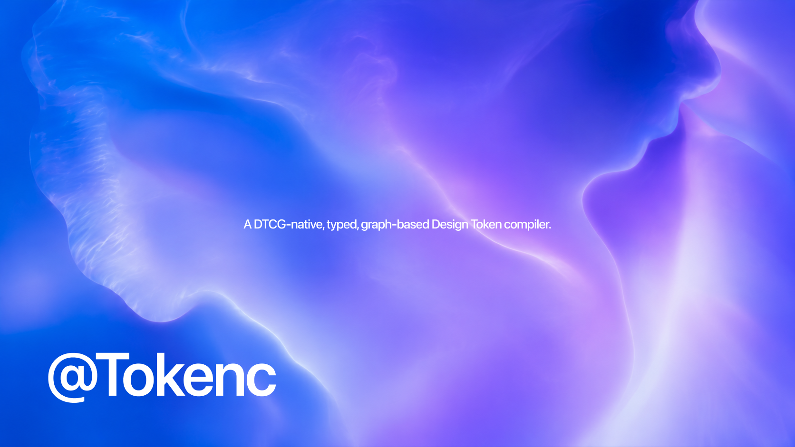

# tokenc



[English](README.md) | [简体中文](README.zh-CN.md)

[](https://www.npmjs.com/package/@tokenc/core)
[](https://github.com/Seeridia/tokenc/actions/workflows/ci.yml)
[](https://nodejs.org/)
[](LICENSE)

> A typed, graph-based compiler for DTCG Design Tokens.

`tokenc` compiles DTCG Design Tokens as a typed program,
checks references and types, evaluates contexts lazily, and emits CSS, Tailwind CSS, or TypeScript
through independent backends.

## Why tokenc

Traditional token pipelines often grow into `JSON → deep merge → transforms → templates`.
`tokenc` uses a compiler model instead:

- **DTCG-native** — `$value`, `$type`, `$description`, `$extensions`, and group type inheritance are
  the source language.
- **Typed** — token values and references are checked before output is emitted.
- **Graph-based** — references become dependency edges, enabling cycle detection, impact analysis,
  `explain`, and `usages`.
- **Context-aware** — theme, brand, density, platform, and custom dimensions are evaluated lazily;
  no Cartesian-product dictionaries are generated.
- **Incremental** — changed files are reparsed and reverse edges identify affected tokens.
- **Backend-driven** — each target decides whether references are preserved, resolved, or emitted as
  symbols.
- **Diagnostic-first** — versioned errors retain registered codes, semantic anchors, stable
  fingerprints, related locations, documentation links, and structured fixes.

## Quick start

Requires Node.js 22.13 or newer.

`tokenc` consumes DTCG 2025.10 token documents. See the
[feature-support matrix](docs/DTCG-SUPPORT.md) for implemented and not-yet-supported standard
features.

```bash
npm install --save-dev @tokenc/cli @tokenc/core @tokenc/backend-css
```

Create `tokens/tokens.json`:

```json
{
  "color": {
    "$type": "color",
    "blue": {
      "600": {
        "$value": {
          "colorSpace": "srgb",
          "components": [0, 0.3215686275, 0.8509803922],
          "alpha": 1,
          "hex": "#0052D9"
        }
      }
    },
    "brand": {
      "default": { "$value": "{color.blue.600}" }
    }
  }
}
```

Create `tokenc.config.ts`:

```ts
import { css } from "@tokenc/backend-css";
import { defineConfig } from "@tokenc/core";

export default defineConfig({
  source: ["tokens/**/*.json"],
  outputs: [
    css({
      output: "dist/tokens.css",
      references: "preserve",
    }),
  ],
});
```

Compile:

```bash
npx tokenc build
```

```css
:root {
  --color-blue-600: #0052d9;
  --color-brand-default: var(--color-blue-600);
}
```

See the [basic example](examples/basic) for CSS, Tailwind CSS, TypeScript, aliases, and component
tokens. The [Resolver example](examples/dtcg-resolver) demonstrates structured DTCG colors, sets,
modifiers, and explicit resolution order.
The [Terrazzo adapter example](examples/terrazzo-adapter) demonstrates a read-only handoff of an
already-bundled standard DTCG document without importing or emulating Terrazzo.
The [React counter](examples/react-counter) is a runnable Vite application that consumes generated
CSS variables and TypeScript constants, and doubles as a complete VS Code extension playground.

## CLI

| Command                         | Purpose                                          |
| ------------------------------- | ------------------------------------------------ |
| `tokenc build`                  | Validate, compile, and write configured outputs. |
| `tokenc check`                  | Validate without writing files.                  |
| `tokenc check --format <type>`  | Emit text, Report v1 JSON, or SARIF 2.1.0.       |
| `tokenc dev`                    | Watch files and compile incrementally.           |
| `tokenc explain <token>`        | Trace a token to its literal value.              |
| `tokenc usages <token>`         | List direct and indirect dependents.             |
| `tokenc graph [token]`          | Print a dependency graph.                        |
| `tokenc graph --format mermaid` | Emit Mermaid graph syntax.                       |
| `tokenc impact <source...>`     | Map changed source files to affected Tokens.     |
| `tokenc diff --base <ref>`      | Compare a Git revision with the worktree.        |
| `tokenc diff --policy <path>`   | Enforce Breaking-change Policy v1.               |

For example, from this repository:

```bash
vp -C examples/basic run tokenc impact tokens/primitive.json
vp -C examples/basic run tokenc impact tokens/primitive.json --format json
vp -C examples/basic run tokenc diff --base HEAD~1 --format json
vp -C examples/basic run tokenc diff --base HEAD~1 --policy tokenc.policy.json
vp -C examples/basic run tokenc check --format sarif
```

Repeat `--context name=value` to restrict impact to a Context region. Without a Context filter,
the report retains exact Predicate regions. Exit code `2` means the result is incomplete, such as
for an unknown source, invalid Snapshot, or unsupported Context.

`diff` reads Git objects and the worktree without checkout, stash, index writes, or branch movement.
It executes only the current trusted configuration. If the default config differs across revisions,
the result is incomplete; passing `--config path` explicitly selects the current config as the
common trusted analysis config.

With `--policy`, exit code `0` is pass, `1` is an unallowed error-level change, and `2` is an
incomplete or invalid decision. Policy rules support severity and Context scope; allow entries refer
to the stable `changeId` emitted by diff.

`check` and `diff` share one immutable report model across text, JSON, and SARIF. Source paths are
repository-relative, and Diagnostic code, severity, location, and fingerprint stay identical across
formats. The JSON envelope schema is exported as `@tokenc/cli/report-v1.schema.json`.

For baseline selection, shallow-clone requirements, exit-code handling, artifact retention, fork
permissions, and a commit-pinned GitHub Actions workflow, see the [CI integration guide](docs/CI.md).

Compilation errors never produce partial output artifacts.

## Compiler model

```text
DTCG 2025.10
    ↓
Parser
    ↓
Typed AST + source provenance
    ↓
Token dependency graph
    ↓
Context resolver + type checker
    ↓
Compiler IR
    ↓
CSS / Tailwind CSS / TypeScript backends
```

References are graph edges, not strings replaced during formatting. The same graph powers alias
resolution, cycle diagnostics, topological output, incremental invalidation, impact analysis, and
the query commands.

Reference resolution is backend policy:

```ts
import { css } from "@tokenc/backend-css";
import { typescript } from "@tokenc/backend-typescript";

css({ references: "preserve" });
typescript({ references: "symbol" });
```

The DTCG 2025.10 Resolver Module is a first-class input: sets and modifiers are composed in explicit
`resolutionOrder`, then aliases are checked on the resulting graph. The non-standard tokenc
extension `org.token-compiler.contexts` represents runtime context-dependent values within one
compilation; it is distinct from Resolver source composition, isolated from standard DTCG parsing,
and normalizes to deterministic typed context overrides.

Non-DTCG formats are outside the compiler language. Convert legacy token files to DTCG before
compilation; an importer or migrator should emit DTCG rather than bypassing the DTCG parser.

See [Architecture](docs/ARCHITECTURE.md) for the data model, context semantics, incremental
invalidation, and backend contracts. The [M1 API stability boundary](docs/M1-API-STABILITY.md)
records supported entry points and direct breaking replacements.

## Programmatic API

```ts
import { compile, parseTokenId } from "@tokenc/core";

const snapshot = await compile({
  source: ["tokens/**/*.json"],
});

if (snapshot.status === "valid") {
  const impact = snapshot.query.impact([parseTokenId("color.blue.600")]);
  console.log(impact.directlyAffected, impact.indirectlyAffected);
}
```

For virtual or remote inputs, use `parseTokenDocument(content, source)` and
`compileDocuments(inputs)`. Parsing is independent of filesystem IO.

## Packages

| Package                                                                                  | Role                                                 |
| ---------------------------------------------------------------------------------------- | ---------------------------------------------------- |
| [`@tokenc/core`](https://www.npmjs.com/package/@tokenc/core)                             | Parser, types, graph, resolver, checker, and IR.     |
| [`@tokenc/cli`](https://www.npmjs.com/package/@tokenc/cli)                               | Build, check, watch, diagnostics, and graph queries. |
| [`@tokenc/language-server`](https://www.npmjs.com/package/@tokenc/language-server)       | Trusted multi-root LSP host for editor integrations. |
| [`@tokenc/backend-css`](https://www.npmjs.com/package/@tokenc/backend-css)               | CSS Custom Properties and context selectors.         |
| [`@tokenc/backend-tailwind`](https://www.npmjs.com/package/@tokenc/backend-tailwind)     | Tailwind CSS v4 `@theme` variables.                  |
| [`@tokenc/backend-typescript`](https://www.npmjs.com/package/@tokenc/backend-typescript) | Object and flat TypeScript exports.                  |

## Token support

| Level           | Types                                                                                    |
| --------------- | ---------------------------------------------------------------------------------------- |
| Fully validated | `color`, `dimension`, `fontFamily`, `number`, `duration`, `fontWeight`                   |
| Fully validated | `cubicBezier`, `strokeStyle`, `border`, `transition`, `shadow`, `gradient`, `typography` |

DTCG colors preserve all 14 standard color spaces, `none` components, alpha, and the optional hex
fallback. String color shorthand is not compiler input. Platform conversion remains a backend
responsibility. Composite values are validated against their DTCG field shapes and numeric ranges.

## Development

The repository uses [Vite+](https://viteplus.dev/) for runtime and package management, checks,
tests, packaging, and monorepo tasks.

```bash
vp install
vp check
vp run -r build
vp test --run
```

This is a library monorepo: packages are built with `vp pack`, orchestrated by `vp run -r build`.

## Documentation

- [Complete VS Code extension guide](docs/VS-CODE-GUIDE.md) · [简体中文](docs/VS-CODE-GUIDE.zh-CN.md)
- [React counter example](examples/react-counter/README.md) · [简体中文](examples/react-counter/README.zh-CN.md)
- [VS Code extension package](packages/vscode-extension/README.md) · [简体中文](packages/vscode-extension/README.zh-CN.md)
- [M2 acceptance record](docs/M2-ACCEPTANCE.md) · [简体中文](docs/M2-ACCEPTANCE.zh-CN.md)
- [M3 execution plan](docs/M3-PLAN.md) · [简体中文](docs/M3-PLAN.zh-CN.md)

- [Architecture](docs/ARCHITECTURE.md) · [中文](docs/ARCHITECTURE.zh-CN.md)
- [Product strategy and roadmap](docs/ROADMAP.md) · [中文](docs/ROADMAP.zh-CN.md)
- [M0 acceptance record](docs/M0-ACCEPTANCE.md) · [中文](docs/M0-ACCEPTANCE.zh-CN.md)
- [M1 execution plan](docs/M1-PLAN.md) · [中文](docs/M1-PLAN.zh-CN.md)
- [M1-01 measurement baseline](docs/M1-01-BASELINE.md) · [中文](docs/M1-01-BASELINE.zh-CN.md)
- [DTCG 2025.10 support](docs/DTCG-SUPPORT.md) · [中文](docs/DTCG-SUPPORT.zh-CN.md)
- [Compiler benchmarks](benchmarks/README.md) · [中文](benchmarks/README.zh-CN.md)
- [Contributing](CONTRIBUTING.md)
- [Releasing](docs/RELEASING.md)

## License

[MIT](LICENSE)
